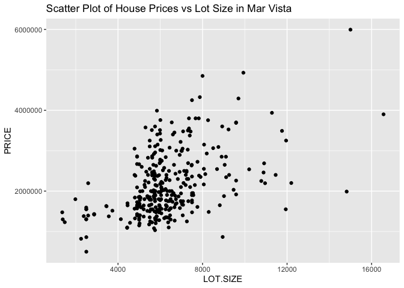

RedFin Housing Prices for Mar Vista
================
Section: B Learning Team: 8 Students: Alex MarMureanu, Caldwell Clarke,
Lyle Seebeck, Kelly Li, Joaquin Trucco

##### Mount up

``` r
library(tidyverse)
library(ggridges)
library(jtools)
library(lmtest)
library(stargazer)
library(ggplot2)
```

##### Get the data set up

``` r
HOUSES <- read.csv("~/Documents/UCLA MBA/Data and Decisions/mba_data_decisions/redfinMarVista.csv", 
                   stringsAsFactors = T)
```

##### Notes on preliminary data selection

-   We are looking at single family homes in the Mar Vista area of LA
    that have been sold in the last 12 months.
-   We have included:
    -   CITY - we’re curious if an LA versus MV address makes a
        difference
    -   PRICE - total paid in last purchase
    -   BEDS - number of bedrooms
    -   BATHS - number of bathrooms
    -   SQUARE.FEET - total square footage of the house itself
    -   LOT.SIZE -total square footage of the property
    -   YEAR.BUILT - how old the house is
-   We have ignored a variety of data points, which we’ll explain below:
    -   SALE.TYPE - all houses are sold
    -   SOLD.DATE - this is a categorical variable, so the regression
        cannot run this variable as time-based, which renders it pretty
        useless
    -   PROPERTY.TYPE - All houses in this set are single-family
        residential
    -   ADDRESS - again, this is one-off categorical data, and is not
        related to location in the regression
    -   STATE.OR.PROVINCE - its all CA
    -   ZIP.OR.POSTAL.CODE - because this is numerical, rather than
        categorical, we would get a trend line for numeric growth in zip
    -   LOCATION - this tries to split between Mar Vista, Palms, etc.
        but the data set is very incomplete and has varying notation
    -   DAYS.ON.MARKET - we expect this to drop prices, but the data set
        is pretty incomplete
    -   X..SQUARE.FEET - $/Square Feet
    -   The remaining fields are internal and not useful

##### Preliminary regression based on variables selected

``` r
Regression1 = lm(PRICE ~ BEDS + BATHS + CITY + SQUARE.FEET + LOT.SIZE + YEAR.BUILT, data = HOUSES)
#summ(Regression1, digits=3)
stargazer(Regression1,single.row = TRUE, type = "text", title = "Regression 1")
```

    ## 
    ## Regression 1
    ## =====================================================
    ##                            Dependent variable:       
    ##                     ---------------------------------
    ##                                   PRICE              
    ## -----------------------------------------------------
    ## BEDS                    -54,163.320 (37,065.290)     
    ## BATHS                  99,724.510*** (35,680.190)    
    ## CITYMar Vista          -143,538.200 (105,102.300)    
    ## SQUARE.FEET                465.830*** (56.252)       
    ## LOT.SIZE                   103.960*** (13.629)       
    ## YEAR.BUILT               3,212.676*** (956.488)      
    ## Constant            -5,904,715.000*** (1,872,465.000)
    ## -----------------------------------------------------
    ## Observations                       321               
    ## R2                                0.746              
    ## Adjusted R2                       0.741              
    ## Residual Std. Error      382,049.500 (df = 314)      
    ## F Statistic             153.561*** (df = 6; 314)     
    ## =====================================================
    ## Note:                     *p<0.1; **p<0.05; ***p<0.01

#### Problem 1

> For each house, calculate the price per square foot. What is the
> average price per square foot in your selected city?

``` r
HOUSES<- HOUSES %>% mutate(Price_sf = PRICE/SQUARE.FEET)
avg_Price_sf <- mean(HOUSES$Price_sf,na.rm = T)
print(avg_Price_sf)
```

    ## [1] 1055.774

-   The average price per squre foot in the neighborhood selected is
    $1056.

#### Problem 2

> Run a simple linear regression of SALE\_PRICE vs SQUARE\_FEET. What is
> your interpretation of the coefficient?

``` r
lm_prob2 <- lm(data = HOUSES, PRICE ~ SQUARE.FEET)
#summ(lm_prob2, digits=3)
stargazer(lm_prob2 ,single.row = TRUE, type = "text")
```

    ## 
    ## ===============================================
    ##                         Dependent variable:    
    ##                     ---------------------------
    ##                                PRICE           
    ## -----------------------------------------------
    ## SQUARE.FEET             682.486*** (25.215)    
    ## Constant            674,095.000*** (58,998.130)
    ## -----------------------------------------------
    ## Observations                    324            
    ## R2                             0.695           
    ## Adjusted R2                    0.694           
    ## Residual Std. Error   415,659.100 (df = 322)   
    ## F Statistic          732.592*** (df = 1; 322)  
    ## ===============================================
    ## Note:               *p<0.1; **p<0.05; ***p<0.01

-   The coefficient of Square Feet is 682.486, meaning that for each
    additional unit of square foot, the price of the house increases by
    682.486 dollars.

#### Problem 3

> Run a multiple regression with additional variables for BEDS and
> BATHS. What do you notice?

``` r
lm_prob3 <- lm(data = HOUSES, PRICE ~ SQUARE.FEET + BEDS + BATHS)
#umm(lm_prob3, digits=3)
stargazer(lm_prob3 ,single.row = TRUE, type = "text")
```

    ## 
    ## ===============================================
    ##                         Dependent variable:    
    ##                     ---------------------------
    ##                                PRICE           
    ## -----------------------------------------------
    ## SQUARE.FEET             653.072*** (53.398)    
    ## BEDS                 -61,205.230 (39,319.040)  
    ## BATHS                66,029.660* (36,472.150)  
    ## Constant            765,291.400*** (89,724.680)
    ## -----------------------------------------------
    ## Observations                    324            
    ## R2                             0.699           
    ## Adjusted R2                    0.696           
    ## Residual Std. Error   413,956.200 (df = 320)   
    ## F Statistic          247.762*** (df = 3; 320)  
    ## ===============================================
    ## Note:               *p<0.1; **p<0.05; ***p<0.01

-   According to the information of regression 3, the coefficient of
    BEDS is -61205.2, meaning that for each additional bedroom, the
    price of the house decreases by -61205.2 dollars and the coefficient
    of BATHS is 66029.7, meaning that for each additional bathroom, the
    price of the house increases by 66029.7 dollars. Also both
    independent variables, BEDS and BATHS, are not statistically
    significant.

#### Problem 4

> If you are analyzing homes other than single family homes (e.g.,
> condos, townhouses), what do you notice about LOT\_SIZE?

-   Our data only contains one observation that’s not single family
    residential.

``` r
cor(HOUSES$PRICE, HOUSES$LOT.SIZE, use = "complete.obs")
```

    ## [1] 0.4753121

``` r
cor(HOUSES$BEDS, HOUSES$LOT.SIZE, use = "complete.obs")
```

    ## [1] 0.2879293

``` r
cor(HOUSES$BATHS, HOUSES$LOT.SIZE, use = "complete.obs")
```

    ## [1] 0.2082299

``` r
cor(HOUSES$SQUARE.FEET, HOUSES$LOT.SIZE, use = "complete.obs")
```

    ## [1] 0.3558679

-   From the correlation tests above, we found that lot size is
    positively correlated with Price, Beds, Baths, and Square Feet.

``` r
ggplot(data = HOUSES, aes(x=LOT.SIZE, y=PRICE) ) + geom_point()+ggtitle("Scatter Plot of House Prices vs Lot Size in Mar Vista")
```

    ## Warning: Removed 1 rows containing missing values (geom_point).

<!-- -->

-   Based on the scatter plot between price and lot size, it is not
    clear whether the two variables are linearly correlated. Therefore,
    we added the quadratic term of the lot size variable and compared
    its regression coefficient with the regression using first power
    only.

``` r
HOUSES <- HOUSES %>% mutate(SQUARE.FEET2 = SQUARE.FEET^2,LOT.SIZE2 = LOT.SIZE^2) # add quadratic term for lot size
linear_lotsize <- lm(data = HOUSES, PRICE~LOT.SIZE)
quadratic_lotsize <- lm(data = HOUSES, PRICE~LOT.SIZE+LOT.SIZE2)
stargazer(linear_lotsize , quadratic_lotsize, single.row = TRUE, type = "text", title="Comparison of the Addition of Quadratic Term on Linear Regression Outputs" )
```

    ## 
    ## Comparison of the Addition of Quadratic Term on Linear Regression Outputs
    ## =============================================================================
    ##                                        Dependent variable:                   
    ##                     ---------------------------------------------------------
    ##                                               PRICE                          
    ##                                 (1)                          (2)             
    ## -----------------------------------------------------------------------------
    ## LOT.SIZE                192.151*** (19.609)          253.903*** (68.785)     
    ## LOT.SIZE2                                               -0.004 (0.004)       
    ## Constant            949,423.100*** (129,640.900) 739,122.300*** (259,280.700)
    ## -----------------------------------------------------------------------------
    ## Observations                    331                          331             
    ## R2                             0.226                        0.228            
    ## Adjusted R2                    0.224                        0.223            
    ## Residual Std. Error    691,787.500 (df = 329)       691,916.500 (df = 328)   
    ## F Statistic           96.022*** (df = 1; 329)      48.431*** (df = 2; 328)   
    ## =============================================================================
    ## Note:                                             *p<0.1; **p<0.05; ***p<0.01

-   Based on the regression outputs above, we could see that the
    quadratic term of lot size has very little effect (coefficient =
    -0.004) on the house price and is not statistically significant
    (p&gt;0.05) at 95% confidence level. Therefore, we could confidently
    incorporate lot size to our regression in its linear term only.

#### Problem 5

> What fraction of the variation in home prices is explained by your
> selected variables? How does your model change with the addition of
> other variables?

``` r
#summ(Regression1, digits=3)
HOUSES$ZIP.OR.POSTAL.CODE <- as.factor(HOUSES$ZIP.OR.POSTAL.CODE) #Convert ZIP Codes to factor
#Add years built, instead of assuming a straight line depreciation, we grouped the years built by <=1 year, 5 years, 10 years,
#30 years, 50 years, 70 years, >70 years 
HOUSES$YEAR.BUILT_cat <- ifelse(2021-HOUSES$YEAR.BUILT<=1, "Less than 1 year",
                                ifelse(2021-HOUSES$YEAR.BUILT<=5, "1 to 5 years",
                                       ifelse(2021-HOUSES$YEAR.BUILT<=10, "5 to 10 years",
                                            ifelse(2021-HOUSES$YEAR.BUILT<=30, "10 to 30 years",
                                              ifelse(2021-HOUSES$YEAR.BUILT<=50, "30 to 50 years",
                                                ifelse(2021-HOUSES$YEAR.BUILT<=70, "50 to 70 years",
                                                  ifelse(2021-HOUSES$YEAR.BUILT>70, "More than 70 years", NA)))))))
table(HOUSES$YEAR.BUILT_cat)
```

    ## 
    ##       1 to 5 years     10 to 30 years     30 to 50 years      5 to 10 years 
    ##                 17                 15                  4                  8 
    ##     50 to 70 years   Less than 1 year More than 70 years 
    ##                 65                 42                178

``` r
#regroup bins to get more even distribution 
HOUSES$YEAR.BUILT_cat <- ifelse(2021-HOUSES$YEAR.BUILT<=5, "Less than 5 year",
                                       ifelse(2021-HOUSES$YEAR.BUILT<=10, "5 to 10 years",
                                            ifelse(2021-HOUSES$YEAR.BUILT<=50, "10 to 50 years",
                                                ifelse(2021-HOUSES$YEAR.BUILT<=70, "50 to 70 years",
                                                  ifelse(2021-HOUSES$YEAR.BUILT>70, "More than 70 years", NA)))))

HOUSES$YEAR.BUILT_cat <- as.factor(HOUSES$YEAR.BUILT_cat )
HOUSES$YEAR.BUILT_cat <- factor(HOUSES$YEAR.BUILT_cat, levels =c( "Less than 5 year", "5 to 10 years","10 to 50 years",
                                                                 "50 to 70 years","More than 70 years") ) #arrange levels
Regression2<-lm(PRICE ~ BEDS + BATHS + CITY + SQUARE.FEET+ LOT.SIZE+ YEAR.BUILT_cat+ DAYS.ON.MARKET + ZIP.OR.POSTAL.CODE, data = HOUSES)
Regression3<-lm(PRICE ~ SQUARE.FEET+ LOT.SIZE+ YEAR.BUILT_cat + DAYS.ON.MARKET, data = HOUSES)
stargazer(Regression1,Regression2 , Regression3,single.row = TRUE, type = "text", title="Comparison of Regression 1, 2, and 3")
```

    ## 
    ## Comparison of Regression 1, 2, and 3
    ## ============================================================================================================================
    ##                                                                      Dependent variable:                                    
    ##                                  -------------------------------------------------------------------------------------------
    ##                                                                             PRICE                                           
    ##                                                 (1)                            (2)                          (3)             
    ## ----------------------------------------------------------------------------------------------------------------------------
    ## BEDS                                 -54,163.320 (37,065.290)        -21,654.040 (33,697.980)                               
    ## BATHS                               99,724.510*** (35,680.190)       49,759.390 (32,589.970)                                
    ## CITYMar Vista                       -143,538.200 (105,102.300)       -57,418.400 (86,416.220)                               
    ## SQUARE.FEET                             465.830*** (56.252)            544.977*** (52.528)          582.847*** (31.415)     
    ## LOT.SIZE                                103.960*** (13.629)             88.301*** (12.347)           85.269*** (12.163)     
    ## YEAR.BUILT                            3,212.676*** (956.488)                                                                
    ## YEAR.BUILT_cat5 to 10 years                                         -32,453.420 (126,104.300)     8,381.814 (124,486.400)   
    ## YEAR.BUILT_cat10 to 50 years                                       -347,244.500*** (86,151.550) -367,236.000*** (85,011.170)
    ## YEAR.BUILT_cat50 to 70 years                                       -240,201.200*** (75,165.620) -257,154.700*** (74,450.150)
    ## YEAR.BUILT_catMore than 70 years                                   -272,861.400*** (68,942.590) -302,751.000*** (67,094.210)
    ## DAYS.ON.MARKET                                                        -869.911*** (178.820)        -875.945*** (177.591)    
    ## ZIP.OR.POSTAL.CODE90066                                             141,696.300* (75,934.510)                               
    ## Constant                         -5,904,715.000*** (1,872,465.000) 584,424.600*** (136,121.700) 735,813.400*** (100,471.800)
    ## ----------------------------------------------------------------------------------------------------------------------------
    ## Observations                                    321                            265                          265             
    ## R2                                             0.746                          0.840                        0.836            
    ## Adjusted R2                                    0.741                          0.833                        0.832            
    ## Residual Std. Error                   382,049.500 (df = 314)          306,079.800 (df = 253)       307,055.600 (df = 257)   
    ## F Statistic                          153.561*** (df = 6; 314)       120.701*** (df = 11; 253)     187.668*** (df = 7; 257)  
    ## ============================================================================================================================
    ## Note:                                                                                            *p<0.1; **p<0.05; ***p<0.01

-   Based on Regression(1), 74.6% of the variation in home prices can be
    explained by our selected variables (BEDS, BATHS, CITY, SQUARE.FEET,
    LOT.SIZE , YEAR.BUILT).
-   For Regression (2), we added in Days on Market to account for
    perception of desirability, and zip/postal code to account for
    location. We also converted Years Built from continuous variable to
    categorical by grouping them into &lt;5 years, 5-10 years, 10-50
    years, 50-70 years, and &gt;70 years. The second model accounts for
    84% of the variation in house prices. After accounting for the
    additional variables, we found that Beds, Baths, and City are not
    associated with House Price at 95% significance level. Compared to
    Houses built within 5 years,those built within 10 years do not have
    a statistically different price. However, those built more than 10
    years have lower prices (with p&lt;0.05). Moreover, we found that
    the longer the days on market, the lower the prices that houses were
    sold for (p&lt;0.05). ZIP codes, however, were not significantly
    associated with house prices, potentially because of the lack of
    geographic variation in the data.  
-   Considering the outputs from Regression (1) and (2), we decided to
    run a final model (Regression 3) by dropping non-significant factors
    and keeping Square Feet, Lot Size, Year Built (categorical), and
    Days on Market. The resulting model has an R-squared of 0.836, which
    is 9% up from the initial regression (0.746).

#### Problem 6

> Try running your model to predict a typical home price. For example,
> what is the predicted sale price of a 2-bedroom, 2-bath home with
> 1,500 square feet? What is the 95% prediction interval?

``` r
#assume other variables are at the mean values
mean_year_built <-  mean(HOUSES$YEAR.BUILT, na.rm=T)
newdata <- data.frame(SQUARE.FEET = 1500,
                      LOT.SIZE = mean(HOUSES$LOT.SIZE,na.rm=T), YEAR.BUILT_cat = "50 to 70 years", DAYS.ON.MARKET = mean(HOUSES$DAYS.ON.MARKET,na.rm=T) )
predict(Regression3, newdata, interval = "confidence", se.fit=T)
```

    ## $fit
    ##       fit     lwr     upr
    ## 1 1732823 1645502 1820143
    ## 
    ## $se.fit
    ## [1] 44342.3
    ## 
    ## $df
    ## [1] 257
    ## 
    ## $residual.scale
    ## [1] 307055.6

-   Assuming a typical home has 2 bedrooms, 2 bathrooms, 1500 sq ft, a
    lot size of 6320 sq ft (mean of data), built in 1964 (mean of data),
    and has been listed for 182 days (mean of data), it will be sold at
    approximately $1,732,823 (95%CI: 1645502, 1820143).

#### Problem 7

> How might you use your model to identify investment opportunities in
> the current housing market in your city?

-   Idea \#1: If we plot the linear equation that comes from the linear
    regression, we can focus our attention on those outliers, which are
    under the line, and check why those houses differ from the price
    predictions of the model. If we cannot find a logical explanation,
    we can assume that these specific outliers are undervalued. We could
    buy that house and sell it for a profit.

-   Idea \#2: You could find information about houses that were sold a
    few years ago and use this information to review their current
    value. After you do that, you can offer to buy the house at a
    cheaper price than the one that the regression suggests, and then
    you could sell it for a profit.

#### Problem 8

> Based on your first-hand knowledge of the city, what other variable(s)
> would you recommend including to better predict residential home
> prices? Pick one of these variables and collect the data for a small
> sample of the homes listed. What is the correlation between your new
> variable and sales price? Be creative!

Mar Vista is a mostly suburban neighborhood to the west of the 405 and
east of the 10. It has some hills, so we may see some variation in price
based on elevation. It’s also close to some major landmarks, so we
assume that well see some variation from proximity to things like the
beach, airport, and freeways. Because it’s very residential, we also
expect to see some variation based on proximity to parks and schools.
There’s also a cute little downtown strip on Venice and Centinela with
shops, restaurants, and a fantastic farmer’s market on the weekends.
We’ll examine the relationship between price and proximity to this area
by measuring the distance from the house to the farmers market via
Google Maps for a selection of 34 houses.

``` r
cor(HOUSES$PRICE, HOUSES$MARKETDIST, use = "complete.obs")
```

    ## [1] 0.04559644

``` r
lm_prob8 <- lm(data = HOUSES, PRICE ~ MARKETDIST)
#summ(lm_prob8, digits=3)
stargazer(lm_prob8 ,single.row = TRUE, type = "text")
```

    ## 
    ## ==================================================
    ##                          Dependent variable:      
    ##                     ------------------------------
    ##                                 PRICE             
    ## --------------------------------------------------
    ## MARKETDIST             78,161.130 (302,714.300)   
    ## Constant            2,218,828.000*** (404,970.900)
    ## --------------------------------------------------
    ## Observations                      34              
    ## R2                              0.002             
    ## Adjusted R2                     -0.029            
    ## Residual Std. Error    1,011,598.000 (df = 32)    
    ## F Statistic               0.067 (df = 1; 32)      
    ## ==================================================
    ## Note:                  *p<0.1; **p<0.05; ***p<0.01

Oddly enough, the price of the house is positively correlated with
distance to the farmer’s market, meaning a house farther away will be
more expensive. It may be running into other confounding location
variables like proximity to the Mar Vista Recreation Center or
elevation, or it may indicate a preference for distance from the more
active areas. We have a high p-value though, so we cannot confidently
say that the distance to the farmer’s market affects the sale price.
