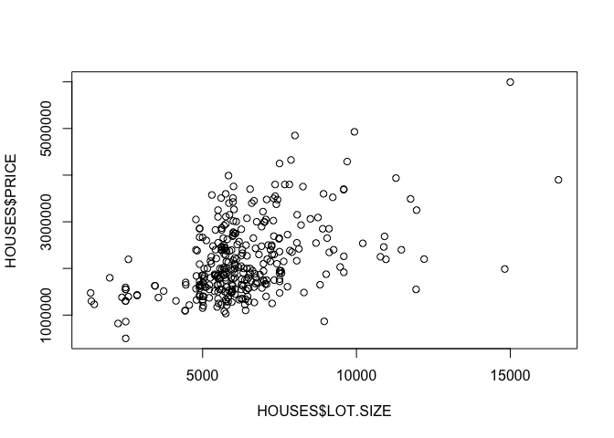

RedFin Housing Prices for Mar vista
================
Section: B Learning Team: 8 Students: Alex MarMureanu, Caldwell Clarke,
Lyle Seebeck, Kelly Li, Joaquin Trucco

##### Mount up

``` r
library(tidyverse)
library(ggridges)
library(jtools)
library(lmtest)
```

##### Get the data set up

``` r
HOUSES <- read.csv("~/Documents/UCLA MBA/Data and Decisions/mba_data_decisions/redfin_2021-10-12-12-54-17.csv", 
                   stringsAsFactors = T)
```

##### Notes on data selection

-   We are looking at single family homes in the Mar Vista area of LA
    that have been sold in the last 12 months.
-   We have included:
    -   CITY - we’re curious if an LA versus MV address makes a
        difference
    -   PRICE - total paid in last purchase
    -   BEDS - number of bedrooms
    -   BATHS - number of bathrooms
    -   SQUARE.FEET - total square footage of the house itself
    -   LOT.SIZE -total square footage of the property
    -   YEAR.BUILT - how old the house is
-   We have ignored a variety of data points, which we’ll explain below:
    -   SALE.TYPE - all houses are sold
    -   SOLD.DATE - this is a categorical variable, so the regression
        cannot run this variable as time-based, which renders it pretty
        useless
    -   PROPERTY.TYPE - All houses in this set are single-family
        residential
    -   ADDRESS - again, this is one-off categorical data, and is not
        related to location in the regression
    -   STATE.OR.PROVINCE - its all CA
    -   ZIP.OR.POSTAL.CODE - because this is numerical, rather than
        categorical, we would get a trend line for numeric growth in zip
    -   LOCATION - this tries to split between Mar Vista, Palms, etc.
        but the data set is very incomplete and has varying notation
    -   DAYS.ON.MARKET - we expect this to drop prices, but the data set
        is pretty incomplete
    -   X..SQUARE.FEET - $/Square Feet
    -   The remaining fields are internal and not useful

##### Regression based on variables selected

``` r
Regression1 = lm(PRICE ~ BEDS + BATHS + CITY + SQUARE.FEET + LOT.SIZE + YEAR.BUILT, data = HOUSES)
summ(Regression1, digits=3)
```

    ## MODEL INFO:
    ## Observations: 321 (11 missing obs. deleted)
    ## Dependent Variable: PRICE
    ## Type: OLS linear regression 
    ## 
    ## MODEL FIT:
    ## F(6,314) = 153.561, p = 0.000
    ## R² = 0.746
    ## Adj. R² = 0.741 
    ## 
    ## Standard errors: OLS
    ## -----------------------------------------------------------------
    ##                               Est.          S.E.   t val.       p
    ## ------------------- -------------- ------------- -------- -------
    ## (Intercept)           -5904714.945   1872464.596   -3.153   0.002
    ## BEDS                    -54163.317     37065.286   -1.461   0.145
    ## BATHS                    99724.505     35680.193    2.795   0.006
    ## CITYMar Vista          -143538.178    105102.268   -1.366   0.173
    ## SQUARE.FEET                465.830        56.252    8.281   0.000
    ## LOT.SIZE                   103.960        13.629    7.628   0.000
    ## YEAR.BUILT                3212.676       956.488    3.359   0.001
    ## -----------------------------------------------------------------

##### Problem 1

> For each house, calculate the price per square foot. What is the
> average price per square foot in your selected city?

``` r
HOUSES<- HOUSES %>% mutate(Price_sf = PRICE/SQUARE.FEET)
avg_Price_sf <- mean(HOUSES$Price_sf,na.rm = T)
print(avg_Price_sf)
```

    ## [1] 1055.774

-   The average price per squre foot in the neighborhood selected is
    $1056.

##### Problem 2

> Run a simple linear regression of SALE\_PRICE vs SQUARE\_FEET. What is
> your interpretation of the coefficient?

``` r
lm_prob2 <- lm(data = HOUSES, PRICE ~ SQUARE.FEET)
summ(lm_prob2, digits=3)
```

    ## MODEL INFO:
    ## Observations: 324 (8 missing obs. deleted)
    ## Dependent Variable: PRICE
    ## Type: OLS linear regression 
    ## 
    ## MODEL FIT:
    ## F(1,322) = 732.592, p = 0.000
    ## R² = 0.695
    ## Adj. R² = 0.694 
    ## 
    ## Standard errors: OLS
    ## -----------------------------------------------------------
    ##                           Est.        S.E.   t val.       p
    ## ----------------- ------------ ----------- -------- -------
    ## (Intercept)         674095.006   58998.134   11.426   0.000
    ## SQUARE.FEET            682.486      25.215   27.066   0.000
    ## -----------------------------------------------------------

-   The coefficient of Square Feet is 682.486, meaning that for each
    additional unit of square foot, the price of the house increases by
    682.486 dollars.

##### Problem 3

> Run a multiple regression with additional variables for BEDS and
> BATHS. What do you notice?

``` r
lm_prob3 <- lm(data = HOUSES, PRICE ~ SQUARE.FEET + BEDS + BATHS)
summ(lm_prob3, digits=3)
```

    ## MODEL INFO:
    ## Observations: 324 (8 missing obs. deleted)
    ## Dependent Variable: PRICE
    ## Type: OLS linear regression 
    ## 
    ## MODEL FIT:
    ## F(3,320) = 247.762, p = 0.000
    ## R² = 0.699
    ## Adj. R² = 0.696 
    ## 
    ## Standard errors: OLS
    ## -----------------------------------------------------------
    ##                           Est.        S.E.   t val.       p
    ## ----------------- ------------ ----------- -------- -------
    ## (Intercept)         765291.386   89724.679    8.529   0.000
    ## SQUARE.FEET            653.072      53.398   12.230   0.000
    ## BEDS                -61205.228   39319.040   -1.557   0.121
    ## BATHS                66029.661   36472.149    1.810   0.071
    ## -----------------------------------------------------------

-   According to the information of regression 3, the coefficient of
    BEDS is -6.1205228^{4}, meaning that for each additional bedroom,
    the price of the house decreases by -6.1205228^{4} dollars and the
    coefficient of BATHS is 6.6029661^{4}, meaning that for each
    additional bathroom, the price of the house increases by
    6.6029661^{4} dollars. Also both independent variables, BEDS and
    BATHS, are not statistically significant.

##### Problem 4

> If you are analyzing homes other than single family homes (e.g.,
> condos, townhouses), what do you notice about LOT\_SIZE?

-   Our data only contains one observation that’s not single family
    residential.

``` r
cor(HOUSES$PRICE, HOUSES$LOT.SIZE, use = "complete.obs")
```

    ## [1] 0.4753121

``` r
cor(HOUSES$BEDS, HOUSES$LOT.SIZE, use = "complete.obs")
```

    ## [1] 0.2879293

``` r
cor(HOUSES$BATHS, HOUSES$LOT.SIZE, use = "complete.obs")
```

    ## [1] 0.2082299

``` r
cor(HOUSES$SQUARE.FEET, HOUSES$LOT.SIZE, use = "complete.obs")
```

    ## [1] 0.3558679

-   From the correlation tests above, we found that lot size is
    positively correlated with Price, Beds, Baths, and Square Feet.

##### Problem 5

> What fraction of the variation in home prices is explained by your
> selected variables? How does your model change with the addition of
> other variables?

``` r
summ(Regression1, digits=3)
```

    ## MODEL INFO:
    ## Observations: 321 (11 missing obs. deleted)
    ## Dependent Variable: PRICE
    ## Type: OLS linear regression 
    ## 
    ## MODEL FIT:
    ## F(6,314) = 153.561, p = 0.000
    ## R² = 0.746
    ## Adj. R² = 0.741 
    ## 
    ## Standard errors: OLS
    ## -----------------------------------------------------------------
    ##                               Est.          S.E.   t val.       p
    ## ------------------- -------------- ------------- -------- -------
    ## (Intercept)           -5904714.945   1872464.596   -3.153   0.002
    ## BEDS                    -54163.317     37065.286   -1.461   0.145
    ## BATHS                    99724.505     35680.193    2.795   0.006
    ## CITYMar Vista          -143538.178    105102.268   -1.366   0.173
    ## SQUARE.FEET                465.830        56.252    8.281   0.000
    ## LOT.SIZE                   103.960        13.629    7.628   0.000
    ## YEAR.BUILT                3212.676       956.488    3.359   0.001
    ## -----------------------------------------------------------------

``` r
plot(HOUSES$PRICE ~ HOUSES$LOT.SIZE) # not linearly related
```

<!-- -->

``` r
HOUSES <- HOUSES %>% mutate(SQUARE.FEET2 = SQUARE.FEET^2,LOT.SIZE2 = LOT.SIZE^2)
Regression2<-lm(PRICE ~ BEDS + BATHS + CITY + SQUARE.FEET+ LOT.SIZE+LOT.SIZE2 + YEAR.BUILT + DAYS.ON.MARKET + ZIP.OR.POSTAL.CODE, data = HOUSES)
summ(Regression2, digits=3)
```

    ## MODEL INFO:
    ## Observations: 265 (67 missing obs. deleted)
    ## Dependent Variable: PRICE
    ## Type: OLS linear regression 
    ## 
    ## MODEL FIT:
    ## F(9,255) = 142.873, p = 0.000
    ## R² = 0.835
    ## Adj. R² = 0.829 
    ## 
    ## Standard errors: OLS
    ## --------------------------------------------------------------------------
    ##                                      Est.            S.E.   t val.       p
    ## ------------------------ ---------------- --------------- -------- -------
    ## (Intercept)                -413662026.670   216336112.394   -1.912   0.057
    ## BEDS                           -31874.281       33906.430   -0.940   0.348
    ## BATHS                           61175.222       32239.915    1.897   0.059
    ## CITYMar Vista                  -93289.517       86696.294   -1.076   0.283
    ## SQUARE.FEET                       514.560          53.139    9.683   0.000
    ## LOT.SIZE                          149.549          40.664    3.678   0.000
    ## LOT.SIZE2                          -0.004           0.002   -1.606   0.110
    ## YEAR.BUILT                       3350.826         877.754    3.817   0.000
    ## DAYS.ON.MARKET                   -902.892         181.699   -4.969   0.000
    ## ZIP.OR.POSTAL.CODE               4523.934        2403.289    1.882   0.061
    ## --------------------------------------------------------------------------

-   74.6% of the variation in home prices can be explained by our
    selected variables (BEDS, BATHS, CITY, SQUARE.FEET, LOT.SIZE ,
    YEAR.BUILT).
-   After adding in quadratic term of lot size (to account for
    non-linear relationship), days on market (account for perception of
    desirability), and zip/postal code (to account for location), the
    new model accounts for 83.5% of the variation in house prices.

##### Problem 6

> Try running your model to predict a typical home price. For example,
> what is the predicted sale price of a 2-bedroom, 2-bath home with
> 1,500 square feet? What is the 95% prediction interval?

``` r
#assume other variables are at the mean values
newdata <- data.frame(BEDS = 2, BATHS = 2, CITY = "Los Angeles", SQUARE.FEET = 1500,
                      LOT.SIZE = mean(HOUSES$LOT.SIZE,na.rm=T), YEAR.BUILT = mean(HOUSES$YEAR.BUILT, na.rm=T))
predict(Regression1, newdata, interval = "confidence", se.fit=T)
```

    ## $fit
    ##       fit     lwr     upr
    ## 1 1850435 1761074 1939795
    ## 
    ## $se.fit
    ## [1] 45417.18
    ## 
    ## $df
    ## [1] 314
    ## 
    ## $residual.scale
    ## [1] 382049.5

``` r
predict_price <- predict(Regression1, newdata, interval = "confidence", se.fit=T)
```

-   Assuming a typical home has 2 bedrooms, 2 bathrooms, 1500 sq ft, and
    a lot size of 6320 sq ft, and built in 1964, it will be sold at
    approximately $1,850,435 (95%CI: 1761074, 1939795).

##### Problem 7

> How might you use your model to identify investment opportunities in
> the current housing market in your city?

-   Idea \#1: If we plot the linear equation that comes from the linear
    regression, we can focus our attention on those outliers, which are
    under the line, and check why those houses differ from the price
    predictions of the model. If we cannot find a logical explanation,
    we can assume that these specific outliers are undervalued. We could
    buy that house and sell it for a profit.  
-   Idea \#2: You could find information about houses that were sold a
    few years ago and use this information to review their current
    value. After you do that, you can offer to buy the house at a
    cheaper price than the one that the regression suggests, and then
    you could sell it for a profit.

##### Problem 8

> Based on your first-hand knowledge of the city, what other variable(s)
> would you recommend including to better predict residential home
> prices? Pick one of these variables and collect the data for a small
> sample of the homes listed. What is the correlation between your new
> variable and sales price? Be creative!

-   some ideas: distance to the airport, proximity to
    parks/greenlands/Whole Foods/Schools, distance to highways
