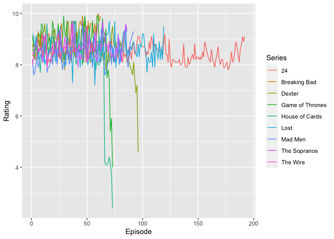
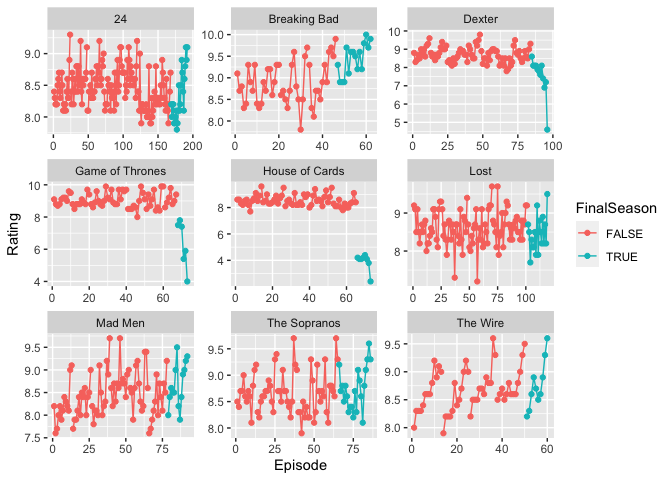
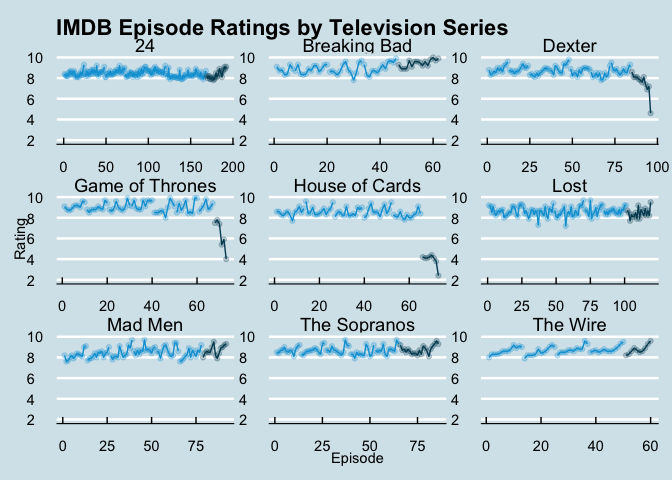
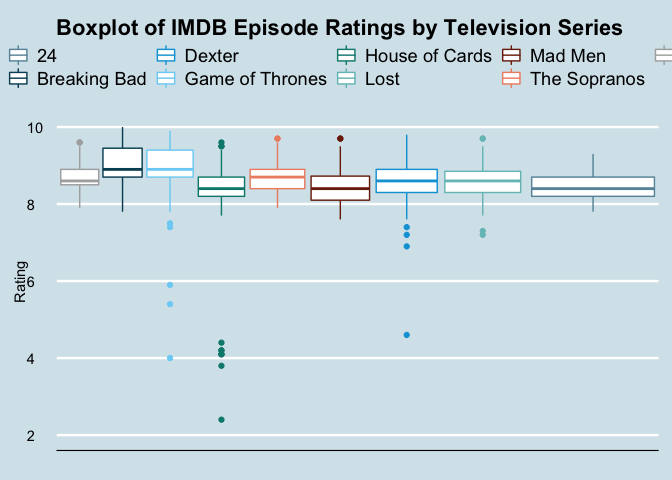
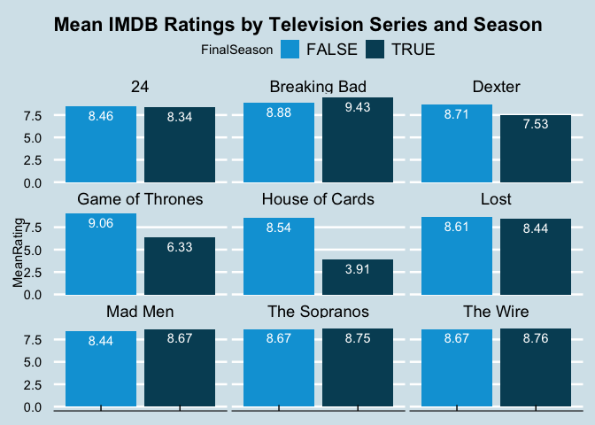
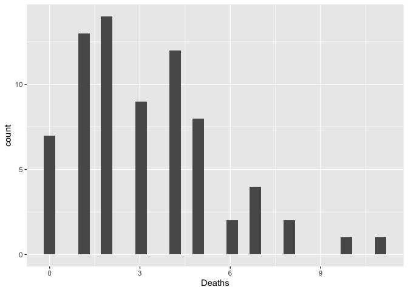
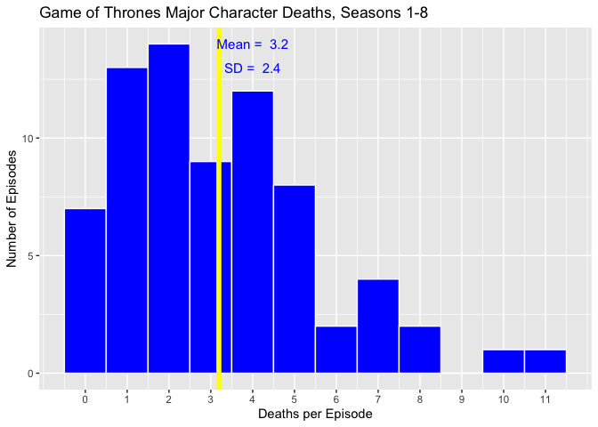
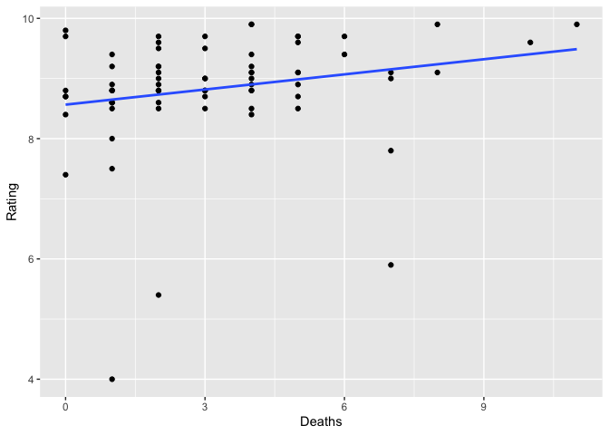
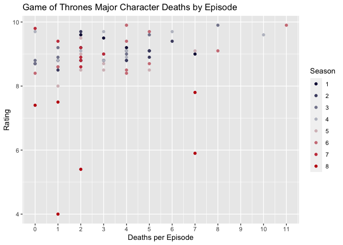
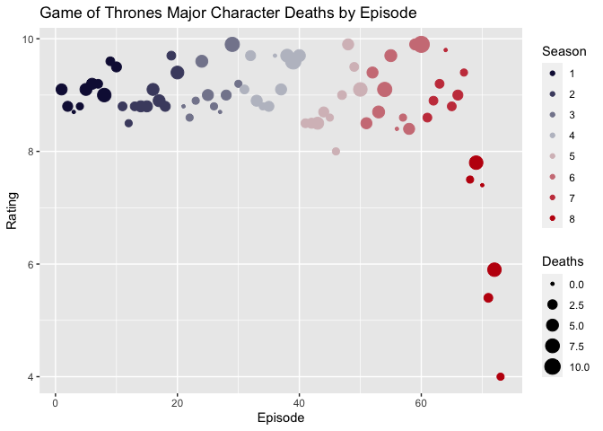

Test
================

# 1. Overview

The Internet Movie Database (IMDB) contains detailed data on films,
television shows, streaming content, and other media. The database
includes information on the cast, crew, plot summaries, and ratings. The
site was originally created by fans but is now owned by Amazon, and
contains data for more than 8 million media titles (source:
<https://en.wikipedia.org/wiki/IMDb>).

The goal of this lab is to (a) calculate summary statistics, (b) create
data visualizations using 5 different graph types, and (c) practice
merging two datasets using a common variable.

# 2. Data Collection

The IMDB.csv file contains TV ratings for 853 episodes of nine popular
television drama series: 24, Breaking Bad, Dexter, Game of Thrones,
House of Cards, Lost, Mad Men, The Sopranos, and The Wire. Each
observation includes the following variables:

-   **Series:** Name of TV series
-   **Episode:** Cumulative episode number within each TV series
-   **Season:** Season number within each TV series
-   **FinalSeason:** Binary variable for whether episode is in the final
    season of the TV series
-   **Rating:** Numerical rating of episode, ranging from 1 to 10

The GOT.csv file contains additional data for each episode of Game of
Thrones (source:
<https://genius.com/Screen-genius-list-of-game-of-thrones-deaths-annotated>)

-   **Episode:** Cumulative episode number within Game of Thrones
-   **Season:** Season number within Game of Thrones
-   **Deaths:** Number of main character deaths occurring in the episode

# 3. Data Exploration

Let’s first install some packages (we only need to do this step once per
computer). Then we need to load the libraries (we must do this every
time we start R Studio).

``` r
# install.packages("tidyverse")
# install.packages("scales")
# install.packages("ggthemes")
# install.packages("gameofthrones")

library(tidyverse)
library(scales)
library(ggthemes)
library(gameofthrones)
```

Let’s set our working drive using setwd(). Note, you must change the
path name to your directory. Use read.csv() to load the IMDB and GOT
datasets. We can also manually import using Import Dataset on the right
panel of R Studio.

``` r
setwd("~/Documents/UCLA MBA/Data and Decisions/Lab1_IMDB")
IMDB = read.csv("IMDB.csv")
GOT = read.csv("GOT.csv")
```

**QUESTION 1:** What are the data types of each variable in IMDB? Use
the str() function to get the structure of the IMDB dataframe.

``` r
str(IMDB)
```

    ## 'data.frame':    853 obs. of  5 variables:
    ##  $ Series     : chr  "Game of Thrones" "Game of Thrones" "Game of Thrones" "Game of Thrones" ...
    ##  $ Episode    : int  1 2 3 4 5 6 7 8 9 10 ...
    ##  $ Season     : int  1 1 1 1 1 1 1 1 1 1 ...
    ##  $ FinalSeason: logi  FALSE FALSE FALSE FALSE FALSE FALSE ...
    ##  $ Rating     : num  9.1 8.8 8.7 8.8 9.1 9.2 9.2 9 9.6 9.5 ...

**SOLUTION:** “Series” is a character variable, “Episode” and “Season”
are integer variables, “FinalSeason” is a logic variable, and “Rating”
is a numerical variable.

**QUESTION 2:** What are the mean rating and standard deviation of
rating, across all episodes in the IMDB database? What are the minimum
and maximum ratings in the data? We will use the built-in R functions
mean(), sd(), min(), and max(). We input a column of numbers using the
notation DATAFRAME$Variable. Let’s store these as new variables called
MeanRating, SdRating, MinRating, and MaxRating.

``` r
MeanRating <- mean(IMDB$Rating)
SdRating <- sd(IMDB$Rating)
MinRating <- min(IMDB$Rating)
MaxRating <- max(IMDB$Rating)
```

**SOLUTION:** The mean rating is 8.563306. The standard deviation is
0.7010735. The minimum rating is 2.4. The maximum rating is 10.

**QUESTION 3:** Using the Game of Thrones (GOT) database, what are the
mean and standard deviation of major character deaths per episode?

``` r
MeanDeath <- mean(GOT$Deaths)
SdDeath <- sd(GOT$Deaths)
```

**SOLUTION:** The mean is 3.1917808. The standard deviation is
2.4017212.

# 4. Data Visualization

## (a) Lineplot

Let’s first construct a simple lineplot of episode ratings, color-coded
by the television series. We will use the package ggplot (which is
loaded as part of tidyverse). The general notation is as follows:

**data = ** specify which dataframe to use

**aes(…)** short for aesthetics; this is where we indicate which
variables (columns) in the dataframe correspond to the x-axis, y-axis,
etc.

**geom\_line()** tells ggplot to use a lineplot; here the () are empty,
but we could add additional modifications inside (eg, size=2,
linetype=“dashed”)

**+ at end of line** tells ggplot to continue reading the code so it
executes all at once

As we will see below, we can further modify aspects of ggplot to achieve
virtually any kind of plot we want!

``` r
ggplot(data = IMDB, aes(x = Episode, y = Rating, color = Series)) +
  geom_line()
```

<!-- -->

This first plot is quite difficult to read, since many of the TV series
are overlapping. Let’s try to make it a little more readable…

Create a lineplot with a subplot for each TV series, using the
facet\_wrap option. Let’s use a different color for the FinalSeason
episodes. And we will add markers to the line plot using geom\_point().
We use geom\_line(aes(group = Season)) to connect the points only within
a particular season.

**QUESTION 4:** Which television series(es) witnessed a substantial
decline in ratings in their final season?

``` r
ggplot(data = IMDB, aes(x = Episode, y = Rating, color = FinalSeason)) + facet_wrap(~ Series, scales = "free") +
  geom_line(aes(group = Season)) + geom_point()
```

<!-- -->

**SOLUTION:** Serieses Game of Thrones, House of Cards, and Dexter had
substantial declines in ratings in their final seasons.

Let’s add some additional formatting in the graph below. We use
scale\_y\_continuous(“Rating”, limits = c(2,10)) to force the y-axis to
be 2 to 10 for every series. The option geom\_point(alpha = 0.25) sets
the transparency of the markers at 25%. We can then adjust the
formatting using the theme\_economist() option from ggthemes, and add a
title using ggtitle. Note, this is quite similar to an actual plot
created by The Economist:
<https://www.economist.com/graphic-detail/2019/05/17/how-unprecedented-is-the-decline-of-game-of-thrones>

``` r
ggplot(data = IMDB, aes(x = Episode, y = Rating, color = FinalSeason)) + facet_wrap(~ Series, scales = "free") +
  geom_line(aes(group = Season)) + geom_point(alpha = 0.25) +
  scale_y_continuous("Rating", limits = c(2,10))  +
  theme_economist() + scale_color_economist() + theme(legend.position = "none") +
  ggtitle("IMDB Episode Ratings by Television Series")
```

<!-- -->

## (b) Boxplot

**QUESTION 5:** Create a boxplot showing the range of ratings by
television series. Which series had the lowest rated episode of all?

``` r
ggplot(data = IMDB, aes(x = Episode, y = Rating, color = Series)) +
  geom_boxplot() +
  scale_x_discrete("", labels = wrap_format(10)) +
  scale_y_continuous("Rating", limits = c(2,10))  +
  theme_economist() + scale_color_economist() + theme() +
  ggtitle("Boxplot of IMDB Episode Ratings by Television Series") 
```

<!-- -->

**SOLUTION:** House of Cards has the lowest rated episode

## (c) Barplot

Suppose we wish to plot the average ratings, by TV series, in the final
season versus all other seasons. First, let’s convert the Series
variable to a factor (categorical) variable:

``` r
IMDB$Series = as.factor(IMDB$Series)
```

Next, we will use the “pipe operator” %&gt;% from the dplyr package (in
tidyverse). This acts like a pass-through operator. In words, this code
says: take the original IMDB data, group it by Series name and Final
Season. Within these 18 groups (9 series and 2 season types), calculate
the summary statistic of mean Rating, using the function mean(). Then,
store this all in a new dataframe called IMDB\_SUMMARY. After you
execute this code, open IMDB\_SUMMARY and make sure you understand what
it did.

``` r
IMDB_SUMMARY = IMDB %>%
  group_by(Series, FinalSeason) %>%
  summarize(MeanRating = mean(Rating))
```

**QUESTION 6:** Which television series had the lowest average rating
during its final season?

**SOLUTION:** House of Cards had the lowest average rating during its
final season: 3.9125.

Let’s create a bar plot of average ratings by Series and Final Season.
We again use facet\_wrap to create 9 subplots, and we add labels to each
bar plot. We use geom\_col() instead of geom\_bar() because we already
calculated the MeanRating for each group.

``` r
ggplot(data = IMDB_SUMMARY, aes(x = FinalSeason, y = MeanRating, label = round(MeanRating, digits=2), fill=FinalSeason)) + facet_wrap(~ Series) +
  geom_col() +
  geom_text(color = "white", nudge_y = -1) +
  theme_economist() + scale_fill_economist() + theme(axis.title.x=element_blank(), axis.text.x=element_blank()) +
  ggtitle("Mean IMDB Ratings by Television Series and Season")
```

<!-- -->

## (d) Histogram

**QUESTION 7:** Using the Game of Thrones (GOT) data, plot a histogram
of the number of major character deaths per episode, using
geom\_histogram(). For histograms, we only specify the variable on the
x-axis (deaths, in this case).

``` r
ggplot(data = GOT, aes(x = Deaths)) +
  geom_histogram()
```

    ## `stat_bin()` using `bins = 30`. Pick better value with `binwidth`.

<!-- -->

Let’s see if we can polish this up a bit. We will use fill=“blue” to
fill in the bars and color=“white” to outline them in white. But you can
pick any colors you like! Quick color reference guide:
<http://sape.inf.usi.ch/quick-reference/ggplot2/colour>

We can specify the binwidth, and where the x-axis has breaks. We add a
vertical yellow line with geom\_vline(…), and report MeanDeaths and
SdDeaths (which are stored as variables) using annotate(…).

``` r
ggplot(data = GOT, aes(x = Deaths)) +
  geom_histogram(fill="blue", color="white", binwidth=1) +
  scale_x_continuous("Deaths per Episode", breaks=0:11) +
  scale_y_continuous("Number of Episodes") +
  geom_vline(xintercept=MeanDeath, color="yellow", size=2) +
  annotate("text", label=paste("Mean = ", round(MeanDeath, digits=1)), x=4, y=14, color="blue", size=4) +
  annotate("text", label=paste("SD = ", round(SdDeath, digits=1)), x=4, y=13, color="blue", size=4) +
  ggtitle("Game of Thrones Major Character Deaths, Seasons 1-8")
```

<!-- -->

## (e) Scatterplot

Here, we will merge our 2 datasets. We will use the pipe operator %&gt;%
again. The line filter(Series == “Game of Thrones”) will only keep
Series if equal to “Game of Thrones”. Note the double == is a Boolean
test that asks *if Series equals “Game of Thrones”*. The
select(c(“Series”, “Episode”, “FinalSeason”, “Rating”)) line indicates
to only keep these columns.

``` r
IMDB_GOT = IMDB %>%
  filter(Series == "Game of Thrones") %>%
  select(c("Series", "Episode", "FinalSeason", "Rating"))
```

Next, we will merge our new IMDB\_GOT dataframe with GOT, using
“Episode” as the key.

``` r
MERGED = merge(IMDB_GOT, GOT, by = "Episode")
```

**QUESTION 8:** What is the correlation between a Game of Thrones
episode rating and number of main character deaths?

``` r
cor(MERGED$Rating, MERGED$Deaths)
```

    ## [1] 0.2114267

**SOLUTION:** The correlation is 0.2114267.

**QUESTION 9:** Create a scatterplot of Game of Thrones episode ratings
on the y-axis, versus major character deaths on the x-axis. We will use
geom\_point() and geom\_smooth(…) to add a best-fitting line. Is this
consistent with your correlation estimate?

``` r
ggplot(data = MERGED, aes(x = Deaths, y = Rating)) +
  geom_point() +
  geom_smooth(method = "lm", se = FALSE)
```

    ## `geom_smooth()` using formula 'y ~ x'

<!-- -->

**SOLUTION:** Yes. Rating is positively correlated with number of deaths
per episode.

Let’s format this plot a bit. We first convert the Season variable to a
factor (categorical) variable. We will color-code the points according
to their season. And we can use GOT-specific color-formatting!
<https://github.com/aljrico/gameofthrones>

``` r
MERGED$Season = as.factor(MERGED$Season)

ggplot(data = MERGED, aes(x = Deaths , y = Rating, color = Season) )+
  geom_point() +
  scale_x_continuous("Deaths per Episode", breaks = 0:12) +
  scale_color_got(discrete = TRUE, option = "Tully") +
  ggtitle("Game of Thrones Major Character Deaths by Episode")
```

<!-- -->

Finally, try some different combinations of variables. Here, we show
ratings over time and use the size of the point to indicate the number
of deaths. Have fun!

``` r
ggplot(data = MERGED, aes(x = Episode, y = Rating, size = Deaths, color = Season)) +
  geom_point() +
  scale_color_got(discrete = TRUE, option = "Tully") +
  ggtitle("Game of Thrones Major Character Deaths by Episode")
```

<!-- -->
